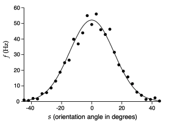

# Population Codes and Brain-Machine Interfaces

## Neural Response Selectivity and receptive Fields

Neurons in many parts of the nervous system have receptive fields: their firing probability is **tuned** to an external stimulus or action 

Over a large populaton, the tuning is distributed.

For nice tuning curves, we can relate firing rate to stimulus, and then recover an estiate of the simulus given sufficiently many simulatenous measurements of firing rates.

This is a so called **population vector** representation of the stimulus.

Reward conditioning the response of a single cortical neuron could result in a change in its firing probability.

## How do we measure population activity in the brain?

- Population-level electrophysiological recordings are obtained using high density microelectrode arrays

### Neural Signal Processing

- Extensive signal processing (band pass filtering, thresholding) is required to obatin signals that correspond to single unit activity, but very challenging in real time
- Individual neural response can be identified by source separation (spike sorting), especially when a single cell is detectable across multiple recording channels
- Alternatively, spatial and time-average activity can be obtained by using low-pass filtered signals

## Challenges

1. Miniaturised electrochemical interface
2. Resolution of recordings: electrical noise
3. Stability of recordings: mechanical and electrical drift
4. Evolution and variability of neural signals over time
5. Latency & feedback delays
6. Neural signal vairability

## Human clinical trials

Tetraplegic subjects with implanted MEAs in primary motor cortex were asked to perform imagined movements.

Data from simple reaching/tracing tasks was used to fit a simple linear model to extract kinematic commands from neural data

## Latency and Feedvack Delays

- Tracing a complex path is difficult in BMIs that decode kinematics directly from motor cortex
- On the other hand, the underlying neural trajectories occur in high dimensional space (many recorded channels) and can often be easily separated by a classifier - this can enable faster and more robust control of a BMI interface

---

# Assigned Reading

1. Neuronal population coding of movement direction

2. A central source of movement
variability