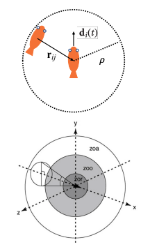

# Collective Decision Making

## Requirements for Collective Decision Making

- Many organisms live in groups, where there is an advanatge to remaining in the group and a cost to being excluded
- Groups also need to make a **collective decision**
- Individuals must reach **consensus**
- Information contained within a single organism needs a **consensus readout** if an action is to be taken
- Costs associated with indecision, but also with making the wrong decision

How can a population of agents (or population of cellsinside an agent) make colective decisions  effectively while navigating these tradeoffs?

## Attractor Networks

1. Ring Atractor: 
    - Local attractor
    - Long-range inhibition 
    - forms a bump of activity 
2. Winner-Take-All Attractor
    - Competition between multiple options
    - Strong cross-inhibition
    - One choice wins and the others are suppressed
    - Collective decision making in honeybee swarms choosing a new nest

## Cross Inhibition is an Optimal Architecture for Decision Making

Insect nest preference is determined by positive and negative feedvack between crowding and conspecific presence (Ame - assigned reading)

## Collective Motion as a Window into Collective Decision Making

This model explains **how groups of animals** (like fish, birds, insects) **move together** without needing a leader.

Each individual updates its direction based on simple rules depending on **how far away** its neighbors are:

### 1. Repel if too close ($\rho < \rho_r$)

If another individual is **very close**, **move away** to avoid collision.

Update rule:
$$
\mathbf{d}_i(t + \Delta t) = -\sum_{j} \frac{\mathbf{r}_{ij}(t)}{|\mathbf{r}_{ij}(t)|}
$$
where $\mathbf{r}_{ij}(t)$ is the vector from individual $i$ to $j$.

### 2. Align if at intermediate distance ($\rho_r < \rho < \rho_a$)

If neighbors are **moderately close**, **match your direction** to theirs.

Update rule:
$$
\mathbf{d}_i(t + \Delta t) = \sum_{j} \frac{\mathbf{v}_j(t)}{|\mathbf{v}_j(t)|}
$$
where $\mathbf{v}_j(t)$ is the velocity (direction) of neighbor $j$.

### 3. Attract if far away ($\rho > \rho_a$)

If neighbors are **far away**, **move toward** them to stay in the group.

Update rule:
$$
\mathbf{d}_i(t + \Delta t) = \sum_{j} \frac{\mathbf{r}_{ij}(t)}{|\mathbf{r}_{ij}(t)|}
$$

### 4. Account for leadership or preferences

Some individuals might have their own **preferred direction** (like scouts).

Bias rule:
$$
\hat{\mathbf{d}}_i(t + \Delta t) = \frac{\mathbf{d}_i(t + \Delta t) + \omega_i}{|\mathbf{d}_i(t + \Delta t) + \omega_i|}
$$
where $\omega_i$ is the individual's preferred direction.

This can result in effective leadership by a minority.

But - which group wins in a population where leadership is delegated?

A sufficiently large 'uninformed subset' can restore majority rule.
An analysis of the model shows that a fold bifurcation occurs as the parameter describing density of uninformed individuals varies. For high densities, numerical advantages is restored to majority group even when preference minority strength is high.