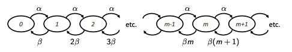

# Cellular Signaling and Logic

## Biological Introduction

### All living systems are organised in a hierachy of scales.

Cellular Life:
- Fundamental structure in living systems is the cell
- Organisms can consist of single cells or multicellular tissues
- Cells _compartmentalise chemical reactions_
- Cells _reproduce_ through division
- Cells can _communicate_ through secretion, receptors & membrane transport

### Genes and the Central Dogma

- DNA -> mRNA -> Protein
- Genome contains all of the information for building a cell; a process known as the central dogma
- Gene expression is the process of assembling macromolecules (RNAs and Proteins) from information (sequences) in the gene sequence
- Gene expression responds to environmental signals (nutrients, hormones, heat, light), in order to make cell components (enzymes, receptors, transporters) that maintain cell function, trigger cell division or even cell death (apoptosis)

## Biochemical Reactions

**Biochemical Signaling** is achieved through **enzymatic reactions**:

- changes in conformational state of proteins (ion channel gating, motor protein activity)
- biosynthesis, anabolism/catabolism (protein synthesis, mRNA synthesis)
- protein-protein interactions (binding, covalent modification phosphorylating/dephosphorylation)

This all seems extremely intricate and complicated! Luckily, we can model all of these processes by **accounting for the dynamics of the changes in concentrations of molecules and their various states...**

### Elementary Reactions

Let $A, B$ denote two chemical species.

We denote these chemical reactions through these mathematical formulations:

- BIND: $A + B -> C$
- UNBIND: $C -> A + B$
- CHANGE CONFORMATION: $A_0 -> A_1 -> A_2 ...$

Of course, microscopically, these reactions are discrete and stochastic and reversible! 

If we have a large enough group of molecules, however, we can model these reactions using simply concentations. 

**The probability of a reaction occuring in any direction depends on the relative concentrations of the species involved**, activation/free energy, other conditions (presence of enzyme, pH etc)

▶️ **Conformational change:** e.g. ion channel gating  
$$A_1 \overset{k_1}{\underset{k_2}{\rightleftharpoons}} A_2$$

▶️ **Binding:** e.g. protein synthesis  
$$P_{n-1} + A_n \xrightarrow{k} P_n$$

▶️ **Binding + Conformational change:** receptor, enzyme activation  
$$R + L \overset{k_1}{\underset{k_2}{\rightleftharpoons}} RL \overset{k_3}{\underset{k_4}{\rightleftharpoons}} R^*L$$  
$$E + S \overset{k_1}{\underset{k_2}{\rightleftharpoons}} ES \xrightarrow{k_3} E + P$$

### Mixing and Compartmentalisation

Consider binding under the conditions $k_1$:
$$
A + B \xrightarrow{k_1} C 
$$
An extremely important point to note is that this may be written as:

$$
\frac{dC}{dt} = k_1 AB
$$

We assume this is under the conditions:

1. assumes the model is _well-stirred_
2. strictly speaking this is never true: all reactions interact with _diffusion_
3. for small molecules, in small volumes/length scales, _diffusion_ can be very fast (e.g. small soluble protein diffuses across E. coli cell in $\approx$ 10 ms)

### Sources, Sinks and Comparmentalisation

At the other extreme, it is often usefgul to model reactions as sources and sinks (if a reactant is extruded from one compartment to another, or if reactants/products are non rate-limiting):

▶️ *source*: e.g. synthesis  
$$\varnothing \rightarrow X$$

▶️ *sink*: e.g. degradation  
$$X \rightarrow \varnothing$$

### Quasi-Equilibira and Michaelis Menten

Similar reasoning applies to the activity of the receptors, promoter regions of genes and other reactions that have "on" and "off" states (respectively, $R, R^*$), triggered by the binding of a ligand, L:

$$
R + L \underset{k_2}{\overset{k_1}{\rightleftharpoons}} R^*L
$$

### The Hill Equation

Now let us generalise the above system to consider situations where multiple copies of a chemical species (ligand/substrate) need to bind:

$$E + nS {\rightleftharpoons} ES_n \rightarrow E + P$$

Similar reasoning allows us to the **Hill Equation**, which describes the dynamics of $P$ as a function of $S$:

$$
\frac{d[P]}{dt} = k \frac{[S]^n}{K+[S]^n}
$$

We denote the exponent $n$ as the **Hill Coefficient**, also sometimes denoted as the cooperativity.

We _loosely_ interpret the **Hill Coefficient** as the number of binding events/interactions required to trigger a full reaction, but in practice the relationship is rarely every this simple.

### Modelling Challenges

Bad news:
- the size and the concentrations can rapidly alter the dynamics of the system: In a small, confined sapce many molecules can be present in low numbers $\rightarrow$ reactions have **discrete state space**
- cells are warm, wet, crowded and small $\rightarrow$ **thermal noise** dominates on fast timescales, so individual reactions are stochastic
- it is very hard to measure rate constants, concentrations and basis parameters of biochemical reaction, and there are likely to be unobserved interactions and states $\rightarrow$ **all models are wrong anyway!**

Good news:
- We can often derive relevant insights from assuming smooth, deterministic dynamics
- EVEN if parameters are wrong/uncertain quantitatively, we can still draw broad qualitative conclusions about how **systems** work.
- Sometimes wrong/crude/"cowboy" models can descrive and predict data very well

### Flow Fields and Qualitatve Dynamics 

Consider the following reaction (an example of **autocatalysis**):

$$A + X  \overset{k_1}{\underset{k_2}{\rightleftharpoons}} 2X$$

The corresponding (mass action) ODE for $[X] := x$, assuming $[A]$ is constant is:
 
$$
\frac{dx}{dt} = k_1 a - 2 k_2x
$$

Can we try and understand the qualitative behaviour of this system? E.g if the parameters are uncertain?

We can _sketch the flow field_, without solving the (potentially intractable) nonlinear equations we can determine the overall behaviour of the system.

### Thresholds and Saturations

Enzymatic reactions, biosynthesis, receptor signalling and cellular signalling generally can be described with nonlinear interactions(often "activations" and "repression/inhibition"). The Hill form is a common prototype for such interactions 

**The Hill function in general is a saturation nonlinearity with threshold**

for some positive interaction where species Y is activated by X:

$$
\frac{dY}{dt} = k \frac{X^n}{K^n+X^n}
$$

as $n$ $\rightarrow$ large, this approaches a **step function**.

for a negative interaction where Y is inhibited by X:

$$
\frac{dY}{dt} = \frac{k}{K^n+X^n}
$$

## Logic Approximations through Biochemical Signalling

**Saturations** and **thresholds** can be used to simplify our understanding of cellular signalling - but they must be _used with care_ and under _certain conditions_. 

We can implicitly write interactions as 'logic approximations' using a threshold function: $\vartheta$:

$$
\theta_K(x) = 
\begin{cases}
1 & \text{if } x > K \\
0 & \text{otherwise}
\end{cases}
$$

Clearly, we are able to see that this threshold function permits us to perform **computation** in the classical sense:

AND Gate (outputs 1 iff both inputs are above their threshold)

$X = \text{AND}(Y,Z)$:

$$
X = \theta (Y-K_1)\theta(Z-K_2)
$$

OR Gate (outputs 1 if either inputs are above their threshold)

$X = \text{OR}(Y,Z)$

$$
X = \theta (Y-K_1) + \theta(Z-K_2)
$$

### Examples of Logic Operations in Cellular Control: lac operon

Under normal conditions, E. Coli metabolise glucose. When glucose isn't available, E. Coli metabolises lactose, but this is less efficient. Each cell can solve this problem by repressing the expression of proteins necessary for lactose metabolism and only turning them on when necessary.

Logical Statement: $O = \&(L, !G)$ 

e.g. O (operon on) iff Lactose ON and glucose OFF. 

### Computation using Biochemical Reactions: The Network View

It is tempting (and often useful) to adopt a network view, treating reactants/chemical species as signals/channels:

## Dynamics of Biochemical Reactions: Microscopic vs Macroscopic 

We wish to ignore the discrete, microscopic nature of chemical reactions and model everything as a concentration (continuous and deterministic).

There are _many_ situations, however, where we cannot ignore discrete nature: e.g. **gene expression**

Consider a simple example. Production and degradation of mRNAs. Assuming transcription is active at a constant rate:

$$
\dot m = \alpha - \beta m
$$

If $m$ is considered discrete, we need to model reactions as probabilistic transitions in the following state diagram:

Here, the rates indicate a constant probability per unit time of a reaction happening. 

We can write the evolution of the probability of being in state $m$ at time $t$, this results in the so called **master equation**:

The time evolution of the probability $P(m, t)$ is given by:

$$
\frac{dP(m, t)}{dt} = \text{flux into state } (m, t) - \text{flux out of state } (m, t)
$$

$$
= \alpha P(m - 1, t) + \beta (m + 1) P(m + 1, t) - \alpha P(m, t) - \beta m P(m, t)
$$

How can we find the distribution of $m$ at a steady state? We may set $\frac{dP(m, t)}{dt}  = 0$, and furter $P(m,t) \rightarrow P(m)$, as we are at a steady state. Hence:

$$
0 = \alpha P(m - 1) + \beta (m + 1) P(m + 1) - \alpha P(m) - \beta m P(m)
$$

Setting $m=0$:

$$
0 = \alpha P(- 1) + \beta P(1) - \alpha P(0) = \beta P(1) - \alpha P(0) \rightarrow P(1) = \frac{\alpha}{\beta}P(0) 
$$

Setting m = 1:

$$
0 = \alpha P(0) + 2\beta P(2) - \alpha P(1) - \beta P(1) \\  P(1) = \frac{\alpha}{\beta}P(0)  \\ 0 = \alpha P(0) + 2\beta P(2) -(\alpha + \beta)(\frac{\alpha}{\beta}P(0)) \\ 
P(2) = \frac{1}{2} \frac {\alpha^2}{\beta^2}P(0)
$$

And so on for all other values of $m$, we find that:

$$
P(m) = \frac{1}{m!} (\frac {\alpha}{\beta})^m P(0)
$$

and to find P(0), we can see that the sum of all probabilities must be 1:

$$
1 = \sum_{m=0}^{\infty} P(m) = P(0) \sum_{m=0}^{\infty} \frac{1}{m!} \left( \frac{\alpha}{\beta} \right)^m 
\Rightarrow P(0) = \exp\left( -\frac{\alpha}{\beta} \right)
$$

Which we derive by clearly identifying the Taylor Series expansion of $e^x$.

And, finally, therefore:

$$
P(m) = \frac{1}{m!} (\frac {\alpha}{\beta})^m e^\frac{\alpha}{\beta}
$$

Which is a poisson with mean $\frac{\alpha}{\beta}$, and a variance $\frac{\alpha}{\beta}$.

---

## Exercise Questions from the Lecture

1. Show that the quasi-equilibrium for this system is:

$R^* = \frac{[L]}{K + [L]}$

then show that if $L$ **inhibits** the reaction we have:

$R^* = \frac{K}{K + [L]}$

2. In the Hill equation section, when considering the loose interpretation of the Hill coefficient, we attempt to consider it as the number of binding events/interactions required to trigger a full reaction - why isn't this relationship that simple?

--- 

# Assigned Reading:

## Some lessons about models from Michaelis and Menten

Paper 1

## Stochastic protein expression in individual cells at the single molecule level

Paper 2

## Detailed map of a cis-regulatory input function

Paper 3

Setty et al (2003) measured the activity of the lac operon as a function of two
inputs, cyclic AMP and IPTG (a synthetic analogue of allolactose), both of which
are required to fully activate the lac operon
- how do these input signals relate to environmental signals (draw a diagram!)
- how was output of the network measured?
- what practical issues had to be overcome? 