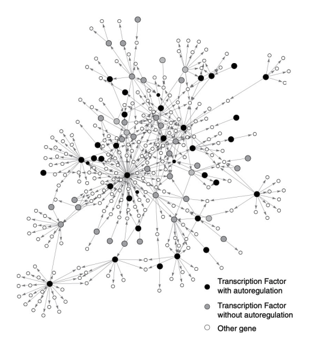
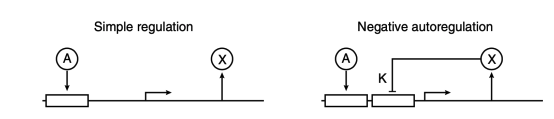

# Regulatory Control in Gene and Protein Networks

## Autoregulation 

### Autoregulation is Prevalent in Nature

Autoregulation: when a gene regulates its own expression

Positive Autoregulation: a gene activates it's own expression

Negative Autogregulation: a gene represses its own regulation

We have proof that autoregulation is prevalent in nature - the amount of 'self-loops' in a gene regulatory network is statistically significant:

## The Need for Regulatory Control

We have a simple model of gene expression:

$$
\dot X = \alpha - \beta X
$$

Let us expand this model to treat systems where, instead of a constant production factor, we have a model where expression depends on rapid binding/unbinding of a transcription factor, A. Over what range of A can we assume constant production?

We note the Hill Function, with transcription factor $A$:

$$
f(A) = \frac{A}{A+K}
$$

Hence, we have that 

$$
\dot X = \alpha f(A)
$$

Therefore, we have a full concentration modelling of 

$$
\dot X = \alpha \frac{A}{A+K} - \beta X
$$

where $\frac{A}{A+K}$ models the rapid binding and unbinding equilibrium of A to promoter sites (as the more $A$, the more bound promoter sites, the less sensitive to $A$ the system becomes), $\beta$ is the degradation constant (no proteins stay alive(?) for ever) and $\alpha$ is the production constant. 

Let us calculate over what range of $A$ we can assume constant production?

We wish 

$$
\alpha \frac{A}{A+K} \approx \text{constant}
$$

When  $ A \gg K$, we have that $\frac{A}{A+K} \approx 1$. Hence, we have:

$$ 
A \gg K
$$

### Negative Autoregulation

Suppose for now we have constant production:

$$
\dot X = \alpha - \beta X
$$

then the solution is:

$$
X(t) = X_{ss}(1-e^{-\beta t}), X_{ss} = \frac{\alpha}{\beta}
$$

Hence, as time ($t$) increases, the response scales with $\frac{1}{\beta}$.

Further,  we may calculate the half-max time:

$$
\text{max}(X(t)) = X_{ss}, \text{half-max}(X(t)) = \frac{X_{ss}}{2}
$$

$$
\frac{X_{ss}}{2} = X_{ss}(1-e^{-\beta t})
$$

$$
\frac{1}{2} = (1-e^{-\beta t})
$$

$$
e^{-\beta t} = \frac{1}{2} 
$$

$$
-\beta t = \ln \frac{1}{2} = -\ln2
$$

$$
\beta t = \ln2
$$

$$
\therefore T_{\frac{1}{2}} = \frac{\ln2}{\beta}
$$

We, however, may wish to see what models may achiever a faster response than this model! This is where **negative autoregulation** comes in:

If X represses its own transcription, we have:

$$
\dot X = \alpha f(X) - \beta X
$$

where 

$$
f(X) = \frac{K^n}{K^n+X^n}
$$

What does this response look like?

As we have previously seen, we may model the response $f(X)$ as a sharp threshold:

$$
f(X) \approx (1-\theta_K(X))
$$

If $\beta X \ll \alpha$, then whilst $X < K$, we have $\dot X \approx \alpha$, which is approximately linear production, which continues until $X>K$. 

Hence, the time taken to reach half-maximum is now $\frac{K}{2\alpha}$.

This is due to the fact that we are basically modelling $f$ with this sharp threshold. 

As 

$$
\dot X = \alpha * (1-\theta_K(X)) - \beta X
$$

so 

$$
\dot{X} =
\begin{cases}
\alpha, & \text{if } X < K \\
-\beta X, & \text{if } X > K
\end{cases}
$$

Clearly, we reach out maximum at $X=K$, so trying the model when we reach the half-max of $\frac{K}{2}$:

$$
\dot X (T_\frac{1}{2}) = \frac{K}{2}
$$

$$
\dot X (T_\frac{1}{2}) = \alpha T_\frac{1}{2}  = \frac{K}{2}
$$

$$
T_\frac{1}{2}  = \frac{K}{2\alpha }
$$

## Negative Autoregulation: Effect on Response Time

--- 

