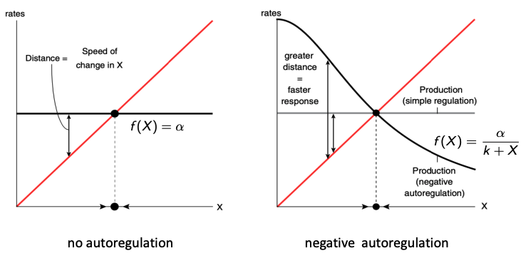
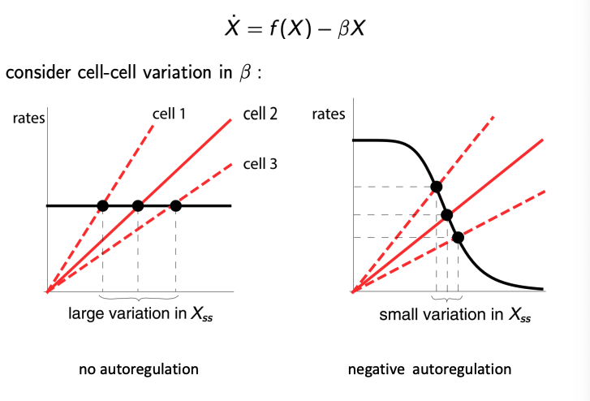

# Regulatory Control in Gene and Protein Networks

## Autoregulation 

### Autoregulation is Prevalent in Nature

Autoregulation: when a gene regulates its own expression

Positive Autoregulation: a gene activates it's own expression

Negative Autogregulation: a gene represses its own regulation

We have proof that autoregulation is prevalent in nature - the amount of 'self-loops' in a gene regulatory network is statistically significant:

## The Need for Regulatory Control

We have a simple model of gene expression:

$$
\dot X = \alpha - \beta X
$$

Let us expand this model to treat systems where, instead of a constant production factor, we have a model where expression depends on rapid binding/unbinding of a transcription factor, A. Over what range of A can we assume constant production?

We note the Hill Function, with transcription factor $A$:

$$
f(A) = \frac{A}{A+K}
$$

Hence, we have that 

$$
\dot X = \alpha f(A)
$$

Therefore, we have a full concentration modelling of 

$$
\dot X = \alpha \frac{A}{A+K} - \beta X
$$

where $\frac{A}{A+K}$ models the rapid binding and unbinding equilibrium of A to promoter sites (as the more $A$, the more bound promoter sites, the less sensitive to $A$ the system becomes), $\beta$ is the degradation constant (no proteins stay alive(?) for ever) and $\alpha$ is the production constant. 

Let us calculate over what range of $A$ we can assume constant production?

We wish 

$$
\alpha \frac{A}{A+K} \approx \text{constant}
$$

When  $ A \gg K$, we have that $\frac{A}{A+K} \approx 1$. Hence, we have:

$$ 
A \gg K
$$

### Negative Autoregulation

Suppose for now we have constant production:

$$
\dot X = \alpha - \beta X
$$

then the solution is:

$$
X(t) = X_{ss}(1-e^{-\beta t}), X_{ss} = \frac{\alpha}{\beta}
$$

Hence, as time ($t$) increases, the response scales with $\frac{1}{\beta}$.

Further,  we may calculate the half-max time:

$$
\text{max}(X(t)) = X_{ss}, \text{half-max}(X(t)) = \frac{X_{ss}}{2}
$$

$$
\frac{X_{ss}}{2} = X_{ss}(1-e^{-\beta t})
$$

$$
\frac{1}{2} = (1-e^{-\beta t})
$$

$$
e^{-\beta t} = \frac{1}{2} 
$$

$$
-\beta t = \ln \frac{1}{2} = -\ln2
$$

$$
\beta t = \ln2
$$

$$
\therefore T_{\frac{1}{2}} = \frac{\ln2}{\beta}
$$

We, however, may wish to see what models may achiever a faster response than this model! This is where **negative autoregulation** comes in:

If X represses its own transcription, we have:

$$
\dot X = \alpha f(X) - \beta X
$$

where 

$$
f(X) = \frac{K^n}{K^n+X^n}
$$

What does this response look like?

As we have previously seen, we may model the response $f(X)$ as a sharp threshold:

$$
f(X) \approx (1-\theta_K(X))
$$

If $\beta X \ll \alpha$, then whilst $X < K$, we have $\dot X \approx \alpha$, which is approximately linear production, which continues until $X>K$. 

Hence, the time taken to reach half-maximum is now $\frac{K}{2\alpha}$.

This is due to the fact that we are basically modelling $f$ with this sharp threshold. 

As 

$$
\dot X = \alpha * (1-\theta_K(X)) - \beta X
$$

so 

$$
\dot{X} =
\begin{cases}
\alpha, & \text{if } X < K \\
-\beta X, & \text{if } X > K
\end{cases}
$$

Clearly, we reach out maximum at $X=K$, so trying the model when we reach the half-max of $\frac{K}{2}$:

$$
\dot X (T_\frac{1}{2}) = \frac{K}{2}
$$

$$
\dot X (T_\frac{1}{2}) = \alpha T_\frac{1}{2}  = \frac{K}{2}
$$

$$
T_\frac{1}{2}  = \frac{K}{2\alpha }
$$

## Negative Autoregulation: Effect on Response Time

To directly compare simple (open loop) regulation and negative autoregulation (NAR), we need to consider parameters that give the same steady-state, namely:

$$
K = \frac{\alpha_{\text{simple}}}{\beta_{\text{simple}}}
$$

Now we may compare the response times of both regulation schemes:

$$
T^{\text{simple}}_{1/2} = \frac{\ln(2)}{\beta_{\text{simple}}}
\quad \quad
T^{\text{NAR}}_{1/2} = \frac{K}{2\alpha_{\text{NAR}}}
$$

$$
\Rightarrow \frac{T^{\text{NAR}}_{1/2}}{T^{\text{simple}}_{1/2}} = \frac{1}{2\ln(2)} \frac{\alpha_{\text{simple}}}{\alpha_{\text{NAR}}}
$$

If we assume strong negative autoregulation we can explicitly calculate the response dynamics:

$$
\dot X = \alpha \frac{K^n}{K^n+X^n} - \beta X = \alpha \frac{1}{1+(\frac{X}{K})^n} - \beta X  
$$

If $(\frac{X}{K})^n \gg 1$, then we may approximate this as 

$$
\dot X = \alpha \frac{K^n}{X^n} - \beta X
$$

We substitute:

$u = X^{n+1}$

Then, using the chain rule:

$\frac{du}{dt} = \frac{du}{dX} \frac{dX}{dt} = (n+1)X^n \dot{X}$

Substituting the expression for $\dot{X}$ from the earlier approximation:

$\dot{X} = \alpha \frac{K^n}{X^n} - \beta X$

gives:

$\frac{du}{dt} = (n+1)\left( \alpha K^n - \beta X^{n+1} \right) = (n+1)\alpha K^n - (n+1)\beta u$

This is just a **linear ODE** in $u(t)$, which we can solve.  
Substituting back to find $X(t)$:

$X(t) = X_{ss} \left( 1 - e^{-(n+1)\beta t} \right)^{\frac{1}{n+1}}$

where $X_{ss}$ is the steady-state value.

The vertical line between the black line (which is production) and the red line (which is degradation) tells you exactly how fast $X$ is changing $\dot X$:

Left Graph:
- red line = $\beta X$
- black line = $f(X) = \alpha$
- distance between them (black line - red line) = $\dot X = f(X) - \beta X$

Right Graph:
- red line = $\beta X$
- black line = $f(X) = \frac{\alpha}{K+X}$
- distance between them (black line - red line) = $\dot X = f(X) - \beta X$

### Negative Autoregulation Reduces Sensitivity: Linear Analysis

There are formal methods we may borrow from linear analysis to analyse the sensitivity of a process/system to parameter variation:

$$
S(A,B) := \frac{\frac{\partial A}{A}}{\frac{\partial B}{B}}
$$

That is to say that, for a linear negative feedback system, we can calculate the sensitivity of the closed loop to the variations in the components:

The transfer function tells us "how to output responds to an input". 
In this example, we have the input as $X$ and the output as $A-KX$. We calculate $G$ through:

$$
X = G (A-KX), X = GA - GKX
$$

$$
X + GKX =  GA, X(1+GK) = GA
$$

$$
X = \frac{GA}{1+GK} = A\frac{G}{1+GK}
$$

Hence, 

$$
T_{A\rightarrow X} = \frac{G}{1+GK}
$$

Let us calculate the sensitivity of T wrt changes in G?

$$
S(T,G) := \frac{\frac{\partial T}{T}}{\frac{\partial G}{G}} = \frac{G}{T} \frac{\partial T}{\partial G} = \frac{1}{1+GK}
$$

Exercise: How does the sensitivity of NAR to variations in production rate $\alpha$ depend on $n$?

$$
\dot X = \alpha \frac{K^n}{K^n+X^n} - \beta X
$$

Let us consider the steady-state dynamics:

$$
\dot{X} = 0
$$

$$
\alpha \frac{K^n}{K^n+X^n} - \beta X = 0
$$

Now we wish to find the relationship between $X$ and $\alpha$:

$$
\alpha \frac{K^n}{K^n+X^n} = \beta X
$$

Multiplying both sides by $(K^n+X^n)$:

$$
\alpha K^n = \beta X (K^n + X^n)
$$

Expanding:

$$
\alpha K^n = \beta X K^n + \beta X^{n+1}
$$

Dividing both sides by $K^n$:

$$
\alpha = \beta X + \beta \frac{X^{n+1}}{K^n}
$$

Now let us compute the partial derivative $\frac{\partial \alpha}{\partial X}$:

$$
\frac{\partial \alpha}{\partial X} = \frac{d}{dX}\left( \beta X + \beta \frac{X^{n+1}}{K^n} \right)
$$

Differentiating term-by-term:

$$
\frac{\partial \alpha}{\partial X} = \beta + \beta (n+1) \frac{X^n}{K^n}
$$

Factoring $\beta$:

$$
\frac{\partial \alpha}{\partial X} = \beta \left( 1 + (n+1) \left( \frac{X}{K} \right)^n \right)
$$

### We wish to calculate the sensitivity $S(X, \alpha)$.

Recall the steady-state relationship:

$$
\alpha = \beta X + \beta \frac{X^{n+1}}{K^n}
$$

We previously computed:

$$
\frac{\partial \alpha}{\partial X} = \beta \left( 1 + (n+1) \left( \frac{X}{K} \right)^n \right)
$$

Now, the sensitivity is defined as:

$$
S(X, \alpha) = \frac{\partial \log X}{\partial \log \alpha} = \frac{\alpha}{X} \frac{\partial X}{\partial \alpha}
$$

Since:

$$
\frac{\partial X}{\partial \alpha} = \left( \frac{\partial \alpha}{\partial X} \right)^{-1},
$$

we have:

$$
\frac{\partial X}{\partial \alpha} = \frac{1}{\beta \left( 1 + (n+1) \left( \frac{X}{K} \right)^n \right)}
$$

Substituting into the sensitivity formula:

$$
S(X, \alpha) = \frac{\alpha}{X} \times \frac{1}{\beta \left( 1 + (n+1) \left( \frac{X}{K} \right)^n \right)}
$$

Now, from the steady-state equation:

$$
\alpha = \beta X \left( 1 + \left( \frac{X}{K} \right)^n \right)
$$

thus:

$$
\frac{\alpha}{X} = \beta \left( 1 + \left( \frac{X}{K} \right)^n \right)
$$

Substituting:

$$
S(X, \alpha) = \frac{ \beta \left( 1 + \left( \frac{X}{K} \right)^n \right) }{ \beta \left( 1 + (n+1) \left( \frac{X}{K} \right)^n \right)}
$$

The $\beta$ terms cancel:

$$
S(X, \alpha) = \frac{1 + (X/K)^n}{1 + (n+1)(X/K)^n}
$$

---

If we further assume $X \gg K$, then $(X/K)^n \gg 1$, and we can approximate:

$$
S(X, \alpha) \approx \frac{1}{n+1}
$$

### Negative Autoregulation Reduces Sensitivity: Graphical Analysis

When we consider cell-cell variation in $\beta$, and the black lines are the production line, and the red lines are the degradation lines, autoregulation permits a smaller variation in $X_{ss} , as the intersection points stay closer together.

## Feedforward Loops

Regulatory networks also contain feedforward loops (FFL) in which signalling passes in parallel through more than one species before converging on an output. 

In the E Coli transcription network there are around 40 3-node FFLs;  the expected number is less than 2.

The functional relevance of an FFL is seen when delays and thresholds are accounted for: hard thredhols can turn a rising signal into a pure delay. FFLs can also reduce false alarms due to fluctuatins when integrating multiple signals.

### Example of  Sequential Gene Expression Network: Flagella

The bacterial flagellum is a multi-subunit protein/filament that needs to be assembled in  order: the corresponding genes are sequentially activated.

---

# Assigned Reading

1. Amplifying genetic logic gates

2. A synthetic oscillatory network of transcriptional
regulators.

3. Synchronous long-term
oscillations in a synthetic gene circuit.

