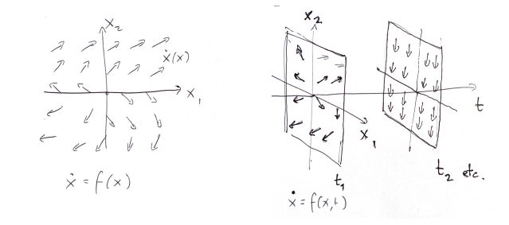
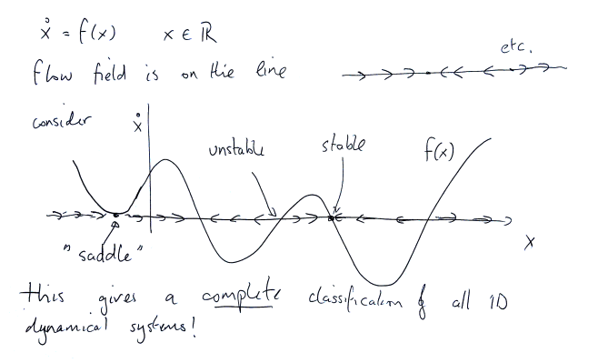
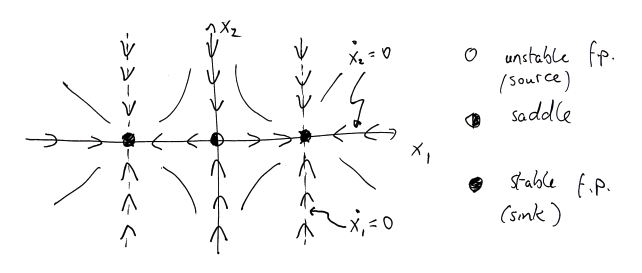

# Some Mathematical Tools and Ideas

## The Flow Field, Equilibria and Nullclines

A smooth continuous time dynamical system can be described by its flow field:

$$
\dot x = f (x, u, t)
$$

Formally, this defines a **vector field** that can be represented geometrically:

## Solutions of Dynamical Systems

Solutions to these systems are called **trajectories**: 

$\{ x(t) \}_{t \geq 0}$ (or just $x(t)$) with $x(0) = x_0$ and $\dot{x}(t) = f(x(t))$ for $t \geq 0$.

## Existence and Uniqueness Theorems for ODEs

Let $x \in \mathbf{R}^n, t \in \mathbf{R}$.  
Suppose $\dot{x} = f(x,t)$ and that $f$ and $\frac{df}{dx}$ are continuous on some domain:

$$
D = \{ (x,t) \mid 0 \leq t \leq T, \, 0 \leq |x - x_0| \leq d \}.
$$

Then there exists a *unique solution* $x(t)$ on some interval $0 \leq t \leq t_1$ with $t_1 \leq T$.  
In particular, we have:

$$
x(t) = x_0 + \int_0^t f(x(s),s) \, ds.
$$

If the function $f(x,t)$ and its derivative with respect to $x$ are continuous, then for a given starting point $x_0$, there is exactly one solution $x(t)$ that solves the differential equation $\dot{x} = f(x,t)$ — and you can compute it by integrating the rate of change over time.

## Open Systems, Closed Systems 

A dynamical system with no input is called a **closed system**, whereas those that can admit an input are called **open systems**:

- Closed: $\dot x = f(x,t)$
- Closed, Autonomous: $\dot x = f(x)$
- Open: $\dot x = f(x,u,t)$

## Modelling

We often model physical, biological systems by considering closed (autonomous) dynamics, then study how dynamics chnage in response to inputs, or coupling between dynamical systems

## Qualitative Theory of Dynamical Systems 

**Equilibria** occur when the flow field is zero:

$$
\dot{x} = f(x) = 0
\quad \text{where} \quad
x =
\begin{bmatrix}
x_1 \\
x_2 \\
\vdots \\
x_n
\end{bmatrix}
$$

**Nullclines** are the loci where $\dot{x}_i = 0$.

That is, the equilibria where, $\forall i , \dot x_i  =0 $
The nullclines are where, for one specific $j, \dot x_j = 0$.

## Classification of 1D Dynamical Systems

Suppose we have a closed, autonomous 1-D smooth dynamical system? What can we say about its flow field?

Hence, what we do is: 

- Draw $f(x)$.
- Find where $f(x) = 0$ (the equilibria).
- Look at the sign of $f(x)$ to determine the direction of flow (left or right).
- Classify each equilibrium as **stable** if $f'(x^*) < 0$, or **unstable** if $f'(x^*) > 0$.

## Classification of 1D Dynamical Systems

Are oscillations possible in closed, autonomous 1D dynamical systems? NO!

Proof by contradiction:

Suppose there is an oscillation i.e. a non-zero periodic solution.

Hence, for any solution $x(t)$, there there must exist $T \neq 0$ and $t_1$ such that:

$$
x(t_1) = x(t_1 +T) := x_1
$$

and 

$$
\dot x(t_1) = f(x_1) \neq 0
$$

WLOG, we assume that $\dot x(t_1) >0$. As $t \rightarrow \infty$, either:

1. $x(t)$ goes to a fixed point, $x_f > x_1$
2. $x(t)$ keeps increasing, $x(t) \rightarrow \infty$

In either case, we have that $x(t) \neq x_1 \forall t > t_1$, hence, a contradiction.

## Linear Dynamical Systems

Recall, that if a dynamical system is linear, then we may describe it generally as:

$$
\dot x = f(x) = \textbf{A}x
$$

then the behaviour is completely determined by the eigenvalues of the matrix $\textbf{A}$.

The possibilities are enumerated below: 

- $\{ \text{Re} \, \lambda_i \} > 0$, $\{ \text{Im} \, \lambda_i \} = 0$

- $\{ \text{Re} \, \lambda_i \} < 0$, $\{ \text{Im} \, \lambda_i \} = 0$

- $\{ \text{Re} \, \lambda_i \} = 0$, $\{ \text{Im} \, \lambda_i \} \neq 0$

- $\{ \text{Re} \, \lambda_i \} > 0$, $\{ \text{Im} \, \lambda_i \} \neq 0$

- $\{ \text{Re} \, \lambda_i \} < 0$, $\{ \text{Im} \, \lambda_i \} \neq 0$

- $\{ \text{Re} \, \lambda_i \} \neq 0$, $\{ \text{Im} \, \lambda_i \} \neq 0$ (mixed signs)

Hence,

- Linear dynamical systems can be understood using tools from linear algebra and systems/control
- These tools, along with a complete description of all linear behaviours, can be used to understand **nonlinear** systems approximately and locally 

## Linearisation

Consider a smooth nonlinear systems:

$$
\dot x = f(x), x \in \mathbf{R}^n
$$

Suppose that $x^*$ is a fixed point (or equilibria point), i.e. $f(x^*) = 0$. Then, let $ \delta x = x - x^*$:

$$
\dot \delta x = \dot x - \dot x^* = f(x)
$$

$$
= f(x^* + \delta x)
$$

$$
= f(x^*) + \frac{\partial f}{\partial x} \delta x + O {(\delta x)^2}
$$

$$
\approx \frac{\partial f}{\partial x} \delta x
$$

Hence, the system:

$$
 \dot (\delta x) = \mathbf{A}\delta x
$$

with 

$$
\mathbf{A} = \left. \frac{\partial f}{\partial x} \right|_{x^*}
$$

is the linearisation of $\dot x = f(x)$ about $x^*$.

## Linearisation: Examples and Stability of Fixed Points

Suppose we have this system of ODE's:

$$
\dot x_1 = -x_1^3+x_1 \\
\dot x_2 = -x_2
$$

Let us derive the fixed points:

$$
0 = -x_1^3 + x_1, x_1(1-x^2_1) = 0  , x_1 = 0, 1, -1
$$

$$
0 = -x_2, x_2 = 0
$$

Hence, the fixed points/equilibria are:

$$
(0,0),  (-1,0) \text{ and } (1,0)
$$

Let us attempt to linearise this system:

$$
A = \frac{\partial f}{\partial \mathbf{x}} = 
\begin{pmatrix}
\frac{\partial f_1}{\partial x_1} & \frac{\partial f_1}{\partial x_2} \\
\frac{\partial f_2}{\partial x_1} & \frac{\partial f_2}{\partial x_2}
\end{pmatrix}
=
\begin{pmatrix}
-3x_1^2 + 1 & 0 \\
0 & -1
\end{pmatrix}
$$

at \((0,0)\), 

$$
A = 
\begin{pmatrix}
+1 & 0 \\
0 & -1
\end{pmatrix}
$$

so

$$
\left\{
\begin{array}{l}
\delta \dot{x}_1 = \delta x_1 \\
\delta \dot{x}_2 = -\delta x_2
\end{array}
\right.
\quad \text{is the linearised system near } (0,0)
$$

and so on.

Now we wish to classify the stability of the fixed points: 

At \((0,0)\),
$$
A = 
\begin{pmatrix}
+1 & 0 \\
0 & -1
\end{pmatrix}
$$
unstable.

At \((-1,0)\),
$$
A = 
\begin{pmatrix}
-2 & 0 \\
0 & -1
\end{pmatrix}
$$
stable.

At \((1,0)\),
$$
A = 
\begin{pmatrix}
-2 & 0 \\
0 & -1
\end{pmatrix}
$$
stable.

Where follow this rule of thumb: 

- Positive real part → unstable.

- Negative real parts → stable.

- Zero real parts → need deeper analysis

## Sketching Phase Planes

1. Find and classify fixed (equilibria) points
2. Compute nullclines

Hence, for the system described previously:

$$
\dot x_1 = -x_1^3+x_1 \\
\dot x_2 = -x_2
$$

## 2D Dynamical Systems: Global Behaviour

**The Poincare-Bendixon Theorem** states that if a trajectory of a smooth planar dynamical system is bounded, it either tends to a fixed point or a periodic orbit.

