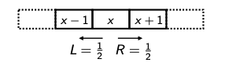
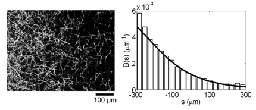
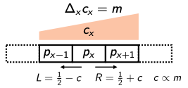

# Chemotaxis

## Chemotaxis Basics

### Chemotaxis is a widespread cellular phenomenom

- Large unicellular organisms such as amoebas possess receptors on their membrane that allow them to sense chemical gradients across the cell diameter

- Cells in multicellular organisms, e.g. axonal growth cones in neurons, do the same during development, sensing hormonal cues to navigate tissue and find their targets

- In the above examples, differential activation of receptors drives (de) polymerisation of the cytoskeleton: the stiff scaffold inside the cell reassembles in the direction of chemoattractants and away from repellants, physically steering the cell

### Chemotaxis in Small, Motile Cells

- Many single-celled organisms, including E Coli, are **motile**
- Cells are propelled by **flagella**, and sense chemicals (nutrients) in the environment with **receptors**, even at low concentrations
- In an environment where there is a concentration gradient, the cells move in the net direction of the gradient.

### Mechanics of Bacterial Mobility

- Flagella attached to motor proteins that propel through aqeuous environments
- Propulsion is possible because of differential viscous drag on cell body vs flagellum microtubule
- Forward moving runs are punctuated by short tumbles the occur when the motor proteins switch and rotate clockwise

### Single Cell Chemotactic Behaviour

Runs have a **constant velocity** and each tumble **randomly** reorients the cell

Remarkably, by **modulating the frequency of tumbles** in response to external stimuli, E. Coli can **systematically move towards attractants** and **away from harmful chemicals** in the environment.

### Reverse Engineering Chemotaxis

Motor switching is caused by diffusion and binding of a protein, CheY-P, to the flaggellar motor

CheY is phosphorylated to the CheY-P through the action of membrane-bound receptors.

### Effect of Attractant Concentration Changes on Flagellar Motor

By immobilising single E Coli cells and subjecting them to brief pulses of attractant, it is possible to measure the impulse response of the motor bias.

What kind of temporal comparison (filter) id this response computing? **Time**!

Therefore,
$$
p(\text{tumble}) \propto \frac{\Delta c}{\Delta t}
$$

and
$$
\frac{\Delta c}{\Delta t} = \frac{\Delta x}{\Delta t} \times \frac{\Delta c}{\Delta x}
= v \frac{\Delta c}{\Delta x}
$$
where $v = \frac{\Delta x}{\Delta t}$ is the velocity.

## Problems of Chemotaxis

### Problem 1: E Coli Need to Outrun Diffusion

E. Coli are small cells and therefore experience the significant effects of fluid viscosity and Brownian motion, whicbh both originate from molecular collisions

How does displacement change over time **simply** dur to diffusion?

Let us consider a discrete random walk: in each timestep, a particle moves left/right with equal probability.

Exercise: Show that the variance in the particles location grows in proportion to time.

Let us denote $S(n)$ as the position of the cell at discrete time $n$.

WLOG, we denote $S(0) = 0$. We have the general rule that 

$$
S(n+1) = 
\begin{cases}
S(n)+1 & \text{with probability } \frac{1}{2} \\
S(n) -1 & \text{with probability } \frac{1}{2}
\end{cases}
$$

We may also say that 

$$
S(n) = \sum_{k=1}^{n} X_k,  \\
\text{where } X_k = \begin{cases}
+1 & \text{with probability } \frac{1}{2} \\
-1 & \text{with probability } \frac{1}{2}
\end{cases}
$$

To find the variance of $S(n)$, we must find the expectation of $S(n)$ and the expectation of $(S(n))^2$:

$$
\mathbb{E} (S(n)) = \mathbb{E} (\sum_{k=1}^{n} X_k) = \sum_{k=1}^{n} \mathbb{E}(X_k) = 0
$$

$$
\mathbb{E} ((S(n))^2) = \mathbb{E} (\sum_{k=1}^{n} X_k)^2 
$$

We now show:

$$
(S(n))^2 = (\sum_{k=1}^{n} X_k)^2 = (\sum_{k=1}^{n} X_k^2) + 2 \sum_{1\leq i < j \leq n}^{n} X_i X_j
$$

So:

$$
\mathbb{E} ((S(n))^2) = \mathbb{E} [(\sum_{k=1}^{n} X_k^2) + 2 \sum_{1\leq i < j \leq n}^{n} X_i X_j] =  \sum_{k=1}^{n} \mathbb{E} (X_k^2) + 2 \sum_{1\leq i < j \leq n}^{n} \mathbb{E} (X_i X_j)
$$

$$
\sum_{k=1}^{n} \mathbb{E} (X_k^2) = n
$$

$$
\sum_{1\leq i < j \leq n}^{n} \mathbb{E} (X_i X_j) = \sum_{1\leq i < j \leq n}^{n} \mathbb{E} (X_i) \mathbb{E} (X_j) = 0
$$

Therefore:

$$
\mathrm{Var} (S(n)) = \mathbb{E}((S(n))^2) - (E(S(n)))^2 = n-0 = n \\ 
\therefore \mathrm{Var} (S(n)) = n
$$
As required.

Without modelling discretely, we may use the fact that the **mean-squaredisplacement** is given by $\mathbb{E}|\textbf{x}(t)|^2) = 2nDt, \forall \textbf{x} \in \mathbf{R}^n$.

For a particle in fluid, the diffusion constant $D$ is given by 

$$
D = \frac{k_B T}{6\pi \eta R} (\text{Stokes-Einstein})
$$

Therefore, the RMS deviation is:

$$
x_{\text{rms}} = \sqrt{6DT} \approx 1 \mu m \text{ in 1s}
$$

Hence, cells make net progress against diffusion because their run velocity is around $20-30 \mu ms^-1$.

### Problem 2: Concentration Gradients can be Very Shallow

Cells need to sample space over many body lengths

What is the solution?

Maintain reasonable mean run duration!
Experimentally, hysteresis in motor switching force durings are greater than $0.1s$ which also ensures an effective tumble!

The surface of the cell can only house relatively few receptors - how can a signal due to handfuls of molecular interactions result in anything detectable?

1. Signal Amplification
2. Temporal Integration
3. Cooperative Sensing

### Problem 3: Brownian Drift in Heading 

Brownian collisions also impart torque impulses, resulting in a gradual deviation over time during a run.

How big is this deviation?

Mean-square rotation is given by:

$$
\mathbb{E}(|\theta(t)|^2) = 2(n-1)D_R t
$$

Rotational Stokes-Einstein formula is:

$$
D_R = \frac{k_B T}{8\pi \eta R^3}
$$

RMS deviation in heading is therefore:

$$
\theta_{\text{rms}} = \sqrt{4 D_R t}
$$

The solution to this:

## Bulk Behaviour of E Coli Populations 

Research showed that when we are able to maintain a steady concentration gradient across a profile of attractants, individual E Coli densities are proportional to the attractant concentration

But why are the cells dispersed across the concentration gradient?

Suppose we now have, instead of a simple random walk, a random walk with some bias, according to a linear concentration gradient:

Let us set up our model assumptions:

- Discretise location, x, into bins of width approximating a typical run length, and time into intervals no longer than the typical run length divided by the run velocity
- Let $p_x$ denote the probability of cell being at location $x$ and $c_x$ denote attractant concentration
- Assume a linear concentration gradient $m$, that proportionately alters tumble probability.

Now, we can write the chnage in $p_x$ in each time increment as :

Then we can write the change in $p_x$ in each time increment, $\Delta_t p_x = p_x(t + \Delta t) - p_x(t)$:

$$
\Delta_t p_x = L p_{x+\Delta x} - L p_x + R p_{x-\Delta x} - R p_x
$$

where $L, R$ = probability of moving left/right.

Expanding:

$$
= \frac{1}{2} (p_{x+\Delta x} - p_x) + c (p_x - p_{x+\Delta x}) + \frac{1}{2} (p_{x-\Delta x} - p_x) + c (p_x - p_{x-\Delta x})
$$

Grouping terms:

$$
= \frac{1}{2} \left[ (p_{x+\Delta x} - p_x) - (p_x - p_{x-\Delta x}) \right] + c (p_{x-\Delta x} - p_{x+\Delta x})
$$

Simplifying:

$$
= \frac{1}{2} \Delta_x (\Delta_x p_x) - 2c \Delta_x p_x
$$

Now divide both sides by the time increment:

$$
\frac{\Delta_t p_x}{\Delta t} = \frac{1}{2} \frac{\Delta_x p_x}{(\Delta x)^2} \Delta x - 2c \frac{\Delta_x p_x}{\Delta x} \frac{\Delta x}{\Delta t}
$$

If we assume $\lim_{\Delta t, (\Delta x)^2 \to 0} \frac{(\Delta x)^2}{\Delta t}$ and $\lim_{\Delta t, \Delta x \to 0} \frac{\Delta x}{\Delta t}$ both exist, this becomes:

$$
\frac{\partial p}{\partial t} = D \frac{\partial^2 p}{\partial x^2} - v \frac{\partial p}{\partial x}
$$

This is the **drift-diffusion equation** with diffusion constant $D$ and velocity $v$.

The solution, for $p(x, 0) = \delta(x)$, is:

$$
p(x, t) = \frac{1}{\sqrt{4\pi D t}} \exp\left( -\frac{(x - vt)^2}{4Dt} \right)
$$

- Gaussian bump moving with velocity $v$
- Shows that in this simplified model the average location of a cell moves with velocity proportional to the concentration gradient $\Rightarrow$ gradient descent (or ascent)!
- The dispersion of a population grows over time according to the run length and run velocity, as captured by the diffusion term

**Question:** at what length and time scales would you expect this model to break down?

1. You look over distances smaller than the typical distance a cell swims before tumbling
2. Over time scales shorter than the time between tumbles

--- 

# Assigned Readings

1. The bacterial chemotactic response reflects a compromise between transient and steady-state behavior

2. An ultrasensitive bacterial motor revealed by monitoring signaling proteins in single cells

