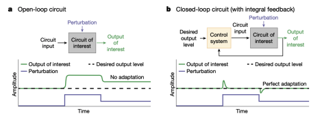

# Antithetic Integral Feedback

## 1: Integral Feedback and Homeostatic Circuits

Integral feedback allows a system to return to a baseline regardless of the perturbations (or change of states) that a system encounters.

The system theoretic view:

The control system is a homeostatic circuit: its role is to keep/restore the output of the system to the desired output (regulation). To achieve this, it must derive some form of estimation of the perturbation, to decide an action that balances its effect. This is achived by combining feedback with an integrator.

- feedback is needed to sense the deviation from the desired output
- the integrator is needed to store information and decide the control action 

Homeostasis/regulation is thus an _adaptive process based on feedback_.

## Biomolecular Realisation of Integral Feedback

Consider the problem of controlling n uncertain biomolecular network. For regulation, we need to realise some form of integral feedback in biological networks.

The _antithetic feedback control motif_ is an irreversible biomolecular reaction which combines an activation species $Z_1$ and a fast pairwaise binding (sequestration) $Z_2$, to provide a biomolecular realisation of integral feedback.

That is, we produce $Z_1$ constantly, and produce $Z_2$ at a rate proportional to $X_L$, with constant $\theta > 0$. Hence, its equations read:

$$
\dot z_1 = \mu - \eta z_1 z_2 \\
\dot z_2 = \theta {x_L} - \eta z_1 z_2
$$

- $X_l$ is the sense species, representing the output that we want to regulate
- $z_2$, the measurement species, is produced at a rate proportional to $X_L$. This is how sensing occurs
- $Z_1$ is produced at a constant rate $\mu$. $Z_1$ will be used later to act on the controlled uncertain network, closing the loop
- $Z_1$ and $Z_2$ annihilate (or sequester) each other at a rate $\eta \gg 1$. This is central for integral feedback.

Where is the integrator? It is encoded by the mismatch between the two species:

$$
\dot z_1 - \dot z_2 = \mu - \theta {x_L} 
$$

Thus, $z_1 - z_2$ integrates the difference between the production rate $\mu$ and the measured output $ \theta x_L$:

$$
z_1(t) - z_2(t) = \int_0^t \left( \mu - \theta x_L(\tau) \right) d\tau.
$$

How to choose the desired output for $X_L$? At equilibrium, $\dot z_1 = \dot z_2 = 0 $, the antithetic feedback control motif satisfies $\mu = \eta z_1 z_2 $ and $\theta x_L$, that is:

$$
\mu = \theta x_L \\ \rightarrow
x_L = \frac{\mu}{\theta}
$$

This means that the steady-state value of $x_L$ is regulated by the production rate $\mu$ (or the sensing rate $\theta$). The steady state of $x_L$ is independent of the particular dynamics of the regulated uncertain network. This is crucial as the regulated network is often affected by large uncertainties.

**Does the antithetic feedback control motif work on _and_ uncertain network?**

Yes, if the closed loop is stable... E.g. the motif guarantees the uniqueness of the steady state $x_L = \frac{\mu}{\theta}$ but does not necessarily guarantee the stability of this steady state. Without stability, the output $x_L$ may not converge to $\frac{\mu}{\theta}$

## Stability Analysis

