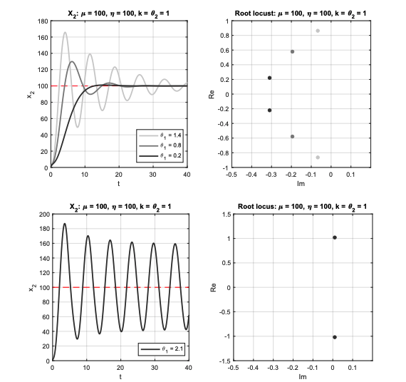

# Antithetic Integral Feedback

## 1: Integral Feedback and Homeostatic Circuits

Integral feedback allows a system to return to a baseline regardless of the perturbations (or change of states) that a system encounters.

The system theoretic view:

The control system is a homeostatic circuit: its role is to keep/restore the output of the system to the desired output (regulation). To achieve this, it must derive some form of estimation of the perturbation, to decide an action that balances its effect. This is achived by combining feedback with an integrator.

- feedback is needed to sense the deviation from the desired output
- the integrator is needed to store information and decide the control action 

Homeostasis/regulation is thus an _adaptive process based on feedback_.

## Biomolecular Realisation of Integral Feedback

Consider the problem of controlling n uncertain biomolecular network. For regulation, we need to realise some form of integral feedback in biological networks.

The _antithetic feedback control motif_ is an irreversible biomolecular reaction which combines an activation species $Z_1$ and a fast pairwaise binding (sequestration) $Z_2$, to provide a biomolecular realisation of integral feedback.

That is, we produce $Z_1$ constantly, and produce $Z_2$ at a rate proportional to $X_L$, with constant $\theta > 0$. Hence, its equations read:

$$
\dot z_1 = \mu - \eta z_1 z_2 \\
\dot z_2 = \theta {x_L} - \eta z_1 z_2
$$

- $X_l$ is the sense species, representing the output that we want to regulate
- $z_2$, the measurement species, is produced at a rate proportional to $X_L$. This is how sensing occurs
- $Z_1$ is produced at a constant rate $\mu$. $Z_1$ will be used later to act on the controlled uncertain network, closing the loop
- $Z_1$ and $Z_2$ annihilate (or sequester) each other at a rate $\eta \gg 1$. This is central for integral feedback.

Where is the integrator? It is encoded by the mismatch between the two species:

$$
\dot z_1 - \dot z_2 = \mu - \theta {x_L} 
$$

Thus, $z_1 - z_2$ integrates the difference between the production rate $\mu$ and the measured output $ \theta x_L$:

$$
z_1(t) - z_2(t) = \int_0^t \left( \mu - \theta x_L(\tau) \right) d\tau.
$$

How to choose the desired output for $X_L$? At equilibrium, $\dot z_1 = \dot z_2 = 0 $, the antithetic feedback control motif satisfies $\mu = \eta z_1 z_2 $ and $\theta x_L$, that is:

$$
\mu = \theta x_L \\ \rightarrow
x_L = \frac{\mu}{\theta}
$$

This means that the steady-state value of $x_L$ is regulated by the production rate $\mu$ (or the sensing rate $\theta$). The steady state of $x_L$ is independent of the particular dynamics of the regulated uncertain network. This is crucial as the regulated network is often affected by large uncertainties.

**Does the antithetic feedback control motif work on _and_ uncertain network?**

Yes, if the closed loop is stable... E.g. the motif guarantees the uniqueness of the steady state $x_L = \frac{\mu}{\theta}$ but does not necessarily guarantee the stability of this steady state. Without stability, the output $x_L$ may not converge to $\frac{\mu}{\theta}$

## Stability Analysis

The antithetic feedback control motif guarantees that the sensed species is insensitive to perturbations. For regulation, we **also** need stability of the closed-loop equilibrium, as stability gaurantees that perturbed trajectories converge to the equilibrium.

To study the stability of the closed loop, we focus on a specific model:

- $ \dot{x}_1 = \theta_1 z_1 - \gamma_p x_1 $
- $ \dot{x}_2 = k x_1 - \gamma_p x_2 $
- $ \dot{z}_1 = \mu - \eta z_1 z_2 $
- $ \dot{z}_2 = \theta_2 x_2 - \eta z_1 z_2 $

Where:
- $ \theta _1 > 0 $ and $ \theta _1 > 0$ are production rates characterisiing the interface between the controlled uncertain network ($x$ variables) and the controller ($z$ variables)
- $\gamma _p > 0$ captures the natural degradation of the species $X_1$ and $X_2$.
- $k>0$ captures the interaction between $X_1$ and $X_2$.

There are 3 general steps for analysing the stability of the system:
1. Compute the equilibirum
2. Linearise the Closed Loop at The Equilibirum
3. Study the stability of the linearised closed loop

### Step 1: Compute the equilibirum

At the equilibrium, $ \dot{x}_1 = \dot{x}_2 = \dot{z}_1 = \dot{z}_2 = 0$.

Hence, 

- $\theta_1 z_1 =\gamma_p x_1 $
- $ k x_1 = \gamma_p x_2 $
- $ \mu = \eta z_1 z_2 $
- $ \theta_2 x_2 = \eta z_1 z_2 $

So:

$$ 
\mu = \theta_2 x_2 \rightarrow x_2^* = \frac{\mu}{\theta_2} 
$$

$$ 
k x_1 = \gamma_p x_2 \rightarrow x^*_1 = \frac{\gamma_p x_2}{k} =  \frac{\gamma_p  \mu}{\theta_2 k}
$$

$$
\theta_1 z_1 =\gamma_p x_1 \rightarrow z_1^* = \frac{\gamma_p x_1}{\theta_1} = \frac{\gamma_p^2  \mu}{\theta_1 \theta_2 k}
$$

$$
\theta_2 x_2 = \eta z_1 z_2 \rightarrow z_2^* = \frac{\theta_2 x_2}{\eta z_1 } = \frac{\mu}{\theta_2} (\frac{\gamma_p^2  \mu}{\theta_1 \theta_2 k})^-1 \frac{\theta_2}{\eta} = \frac{\theta_1 \theta_2 k}{\eta \gamma_p^2}
$$

Hence, we have computed the steady state values from $X_1, Z_1, Z_2$ depend on the parameters of the system, which are often uncertain. Hence, the steady-state values adapt to guarantee that the steady-state value of $X_2$ reaminds unchanged.

### Step 2: Linearise the Closed Loop at the Equilibirum

#### Derivation of the Jacobian matrix $A$:

We start with the nonlinear system:

- $ \dot{x}_1 = \theta_1 z_1 - \gamma_p x_1 $
- $ \dot{x}_2 = k x_1 - \gamma_p x_2 $
- $ \dot{z}_1 = \mu - \eta z_1 z_2 $
- $ \dot{z}_2 = \theta_2 x_2 - \eta z_1 z_2 $

Define small perturbations around equilibrium:

- $ \delta = ( \delta x_1, \delta x_2, \delta z_1, \delta z_2 )^T $

The linearized system is:

- $ \dot{\delta} = A \delta $

where $ A $ is the Jacobian matrix built from partial derivatives:

#### Partial derivatives:

For $ \dot{x}_1 = \theta_1 z_1 - \gamma_p x_1 $:
- wrt $ x_1 $: $ -\gamma_p $
- wrt $ x_2 $: $ 0 $
- wrt $ z_1 $: $ +\theta_1 $
- wrt $ z_2 $: $ 0 $

For $ \dot{x}_2 = k x_1 - \gamma_p x_2 $:
- wrt $ x_1 $: $ +k $
- wrt $ x_2 $: $ -\gamma_p $
- wrt $ z_1 $: $ 0 $
- wrt $ z_2 $: $ 0 $

For $ \dot{z}_1 = \mu - \eta z_1 z_2 $:
- wrt $ x_1 $: $ 0 $
- wrt $ x_2 $: $ 0 $
- wrt $ z_1 $: $ -\alpha $
- wrt $ z_2 $: $ -\beta/\alpha $

For $ \dot{z}_2 = \theta_2 x_2 - \eta z_1 z_2 $:
- wrt $ x_1 $: $ 0 $
- wrt $ x_2 $: $ +\theta_2 $
- wrt $ z_1 $: $ -\alpha $
- wrt $ z_2 $: $ -\beta/\alpha $

where:

- $ \alpha = \frac{\theta_1 \theta_2 k}{\gamma_p^2} $
- $ \beta = \eta \mu $

#### Final Jacobian matrix:

$$ A = 
\left(
\begin{array}{cccc}
-\gamma_p & 0 & \theta_1 & 0 \\
k & -\gamma_p & 0 & 0 \\
0 & 0 & -\alpha & -\beta/\alpha \\
0 & \theta_2 & -\alpha & -\beta/\alpha
\end{array}
\right)
$$

### Step 3: Study the Stability of the Linearised Closed Loop

The equilibrium is stable if _all_ of the eigenvalues of the matrix $A$ have _negative_ real part. 

The characteristic polynomial is:

- $ \det(sI - A) = (s + \gamma_p)^2 \left( s^2 + \left( \alpha + \frac{\beta}{\alpha} \right) s \right) + \gamma_p^2 \beta $

where:

- $ \alpha = \frac{\theta_1 \theta_2 k}{\gamma_p^2} $
- $ \beta = \eta \mu $

We see plots below for different values of $\theta_1$.

The _production-degradation inequality_ holds:

$$
\frac{\theta_1 \theta_2 k}{2} < \gamma_p^3
$$

## Robust Stability and Pathological Oscillations

We want to ensure that that, even in the presence in uncertainties around our parametes, the closed loop remains stable. 

We may do this through _Monte-Carlo Sampling_, whereby we simply sample parameter values within a reasonable range, for each set of parameters, we follow the three steps above (comptute equilibirum, linearise, stability of linearised closed loop).

A more nuanced method is the use of the **Nyquist Criterion**.

$$
\boxed{\text{Nyquist criterion: the closed loop is stable if −1/γ remains to the left of the Nyquist
diagram of L(s).}}
$$

# Nyquist Cheatsheet (Exam Version)

## 1. What is a Nyquist plot?
- Plot of $ L(j\omega) $ (open-loop transfer function) as frequency $ \omega $ varies.
- x-axis = real part of $ L(j\omega) $.
- y-axis = imaginary part of $ L(j\omega) $.

## 2. What is the Nyquist Stability Criterion?
- The closed-loop system is **stable** if the Nyquist plot **does NOT encircle** the point $ -1 $.
- In your notes: stability if $ -1/\gamma $ stays **to the left** of the Nyquist plot.

## 3. How to use it practically?
- If curve stays away from $ -1 $ → **Stable**.
- If curve wraps around or touches $ -1 $ → **Unstable**.
- Look at where the curve goes when given a Nyquist diagram.

## 4. Parameter effects:
- Increase $ k $ (production) → Nyquist plot grows → **risk of instability**.
- Increase $ \gamma_p $ (degradation) → Nyquist plot shrinks → **more stable**.
- High $ \eta $ (fast sequestration) makes stability analysis easier.

## 5. Quick mental checklist:
- "Is the curve avoiding $ -1 $? ✅ Good."
- "If I increase $ k $, will the curve grow? ✅ Yes, might destabilize."
- "If I increase $ \gamma_p $, will the curve shrink? ✅ Yes, better stability."

# 🎯 Summary:
"Plot $ L(j\omega) $, watch $ -1 $, control $ k $ and $ \gamma_p $."

## The Effects of Controller Species Degradation 

In the previous sections, we have assumed that the controller species do not degrade - but this is unavoidable.

Degradation is modelled with:

- $ \dot{z}_1 = \mu - \eta z_1 z_2 - \gamma_c z_1 $
- $ \dot{z}_2 = \theta_2 x_2 - \eta z_1 z_2 - \gamma_c z_2 $

where $ \gamma_c $ is the degradation rate. 

Note that the difference $ z_2 - z_1 $ is not anymore an integrator but a stable first-order filter:

- $ \dot{z}_2 - \dot{z}_1 = -\gamma_c (z_2 - z_1) + \mu - \theta_2 x_2 $

Differently from an inetgrator, a first order filter "forgets" past values (fading memory). The filter stores recent values but forgets remote values (leak). This leads to equilibrium. 

For constant signals:

- $ \dot{z}_2 - \dot{z}_1 = 0 $

thus:

- $ z_2^* - z_1^* = \frac{\mu - \theta_2 x_2}{\gamma_c} $

In the limit of strong binding $ \eta \gg 1 $, the steady-state output satisfies:

- $ x_2^* = \frac{\mu}{\theta_2 \left( 1 + \frac{1}{\alpha} \right)} $

The steady-state error is:

- $ \frac{\mu}{\theta_2} \left( \frac{1}{1+\alpha} \right) $

which reduces to zero as $ \gamma_c \to 0 $.

The production-degradation inequality for closed-loop stability becomes:

- $ \frac{\theta_1 \theta_2 k}{2} < \gamma_c (\gamma_c + \gamma_p)^2 $

The block diagram effect:

- The integrator $ \frac{1}{s} $ is replaced by the first-order filter $ \frac{1}{s + \gamma_c} $.

--- 

# Assigned Reading

1. Hard limits and performance tradeoffs in a class of antithetic integral feedback
networks

2. Antithetic integral feedback ensures robust perfect adaptation in noisy biomolecular networks

3. A universal biomolecular integral feedback controller for robust perfect adaptation

