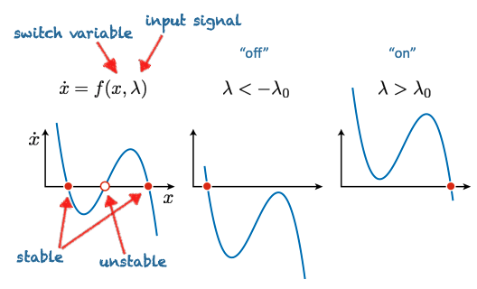
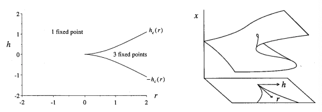

# Switches and Pulses (Bifurcations 1)

## Motivation 

We are able to understand nonlinear systems by analysing the phase plane of the flow field:

$$
\dot x = f(x,u,t)
$$

Much of the analysis revolves around findind **fixed points** and analysing their **stability** using a linearisation of the system.

A **switch**, however, involves an abrupt change in the state of a sytem to a new state (and possible back agai in case of a pulse).

We therefore need a new theory, that is able to handle **chnages in stability of fixed points**: **bifurcation theory**.

## The Need for Switches

Many biological processes involve decisions among a discrete number of outcomes based on integration of continuous signals in time and space.

E.g: cellular differentiation during development:
1. all cells in multicellular organisms originate from division 
2. their subsequent identity is determined by internal and external signals
3. in Drosophilia, the early stages are dependent on morphogen gradients
4. This gradient results in discrete segmentation into distinct populations that for the basic body plan 

## Cell Fate: An iterative Decision Process for Development

- We know how tissues are formed from embryonic stem cells onwards
- We can even reprogram cells to enter the stem cell state - induced pluripotency 

## Multistability

1. Nonlinearities in reaction rates generate multiple stable equilibria
2. These equilibria serve as a form of cellular memory

Suppose we have the example where species $X$ and $Y$ inhibit each others production. We would therefore expect, given usual circumstances, that one of these may "win out" - that is, rest at a steady state of high $X$ and low $Y$ or vice verse.

Hence, this is modelled by  a nonlinear ODE described their relationship, with two different steady states!

An example is here:

$$
\dot x = \frac{k}{k+y^n} - \beta x
$$

$$
\dot y = \frac{k}{k+x^n} - \beta y
$$

## Multistability in a Synthetic Biological Circuit 

The above "toggle" switch is a rational synthetic biology circuit constructed in single cells.

## What is a switch?

The hallmark of a switch is **hysteresis**:

- there needs to be **more than one** steady state
- each steady state needs to be **stable**
- the basin of attraction determines the **robustness** of the switch

## Switches, Bifurcations and Singularities

We can model a switch by saying that we begin with an initial conditon, and an input which moves you to a different outcome:

$$
\dot x = f(x+h) , x(0) = h_0
$$

But, it is easy to see that we can achieve a switch by changing the structure of the system itself:
Now, we may model it as:

$$
\dot x = rx - x^3 + h
$$

When we redefine $r$ and $h$ as inputs/parameters:

1. The fixed points undergo **a change in stability** as these parameters are varied, such changes are called *bifurcations**

2. The equation above is called the **normal form** of the cusp singularity - informally, it captures all of the ways hysteresis can form around the so-called **singular point**:

$$
(r,h) = (0,0)
$$

## Bifurcations

Lets examine the stability of fixed points, $x$ as $r$ and $h$ are varied:

$$
\dot x = rx - x^3 + h
$$

This is straightforward since the resulting system is just a 1D dynamical system.

For $r>0$, variations in $h$ result in single stable steady states at low and high values of $x$, with a multistable region in between, the plot of these fixed points (indicating their stability) is called a **bifurcation diagram**.

If we consider $h$ as an input signal, then a large pulse from $0$ beyond a critical value $\pm |hc|$ will switch the system between low/high steady states, resulting in a **fold bifurcation**.

Moving between these transitions results in hysteresis, indicating **memory** in the system.

## Bifurcations: Catastrophes and Normal Forms

If we unfold the plot of the equilibria in the $(r,h)$ plane then we get a global diagram of the so call **cusp catastrophe**::

Even in an arbitrarily complex system, this is one of the few prototypical ways to generate a hysteresis.

This **deep** result comes from singularity theory, which says that in "nice" nonlinear dynamical systems there are only relativley few ways to abruptly change stability with a single input variable.

## Bifurcations: Other Bifurcations & Normal Forms

| Normal Form | Bifurcation Type | Key Feature | Robustness |
|:------------|:-----------------|:------------|:-----------|
| $ \dot{x} = r x \pm x^3 $ | Pitchfork bifurcation | Symmetric splitting (supercritical or subcritical) | **Not robust** (sensitive to $h$) |
| $ \dot{x} = r + x^2 $ | Saddle-node bifurcation | Creation or annihilation of fixed points | **Robust** |
| $ \dot{x} = r x - x^2 $ | Transcritical bifurcation | Exchange of stability between two fixed points | **Moderately robust** |

---

✅ **Memory Tip:**  
- If you see $ x^3 $, think **pitchfork** (symmetry!),
- If you see $ +x^2 $, think **saddle-node** (birth/death!),
- If you see $ -x^2 $, think **transcritical** (exchange!).

# Bifurcation Exam Checklist

## Basic concepts
- What is a bifurcation? (Change in number or stability of steady states)
- What is a fixed point? (Set $ \dot{x} = 0 $ and solve for $x$)
- What is stability? (Check sign of $ \frac{d\dot{x}}{dx} $)

## Types of bifurcations
- Saddle-node bifurcation: creation or annihilation of fixed points.
- Pitchfork bifurcation: symmetric splitting (supercritical or subcritical).
- Transcritical bifurcation: exchange of stability between branches.

## Normal forms
- Saddle-node: $ \dot{x} = r + x^2 $
- Pitchfork: $ \dot{x} = r x \pm x^3 $
- Transcritical: $ \dot{x} = r x - x^2 $

## Method for any bifurcation question
1. Solve $ \dot{x} = 0 $ to find steady states.
2. Linearize: compute $ \frac{d\dot{x}}{dx} $.
3. Classify stability:
   - Positive slope $\rightarrow$ unstable,
   - Negative slope $\rightarrow$ stable.
4. Sketch bifurcation diagram (r on x-axis, x on y-axis).
5. Identify the type of bifurcation.

## Ghosts and Critical Slowing Down

Consider a saddle node bifurcation:

$$
\dot x = r + x^2
$$

What can we say about the dynamics of the system in the vicinity of the bifurcation (e.g. close to the critical $r, r_c$).

The dynamics slow down in this region!

$$
\text{For } x \sim \epsilon, r \sim \epsilon: \\
|\dot x| = |r+x^2| \leq \ |r| + |x^2| < 2\epsilon    
$$

The question of how a system might respond to fluctuations in this region is left for the assigned readings.

## From switches, to pulses, to oscillators: A Look Ahead

Take a nonlinear system with hysteresis in one state variabke:

$$
\dot v = -v^3 +r v + I
$$

How does this relate to the "fast" IV curve measured by Hodgkin & Huxley?

Now, we introduce an additional slow state variable ('recovery variable') with dynamics:

$$
\dot w = v + \gamma w + w_0
$$

We obtain a planar nonlinear system with a **fast and slow timescale**!

$$
\dot v = -v^3 +r v + - w+I
$$

$$
\dot w = \epsilon( v + \gamma w + w_0)
$$

This is a nonlinear oscillator/pulse generator closely related to the Van der Pol oscillator!

---

# Assigned Reading

1. Probing the limits to positional
information

2. Cell lineages and the
logic of proliferative control

3. Recovery rates reflect distance to a tipping point in a living system.

