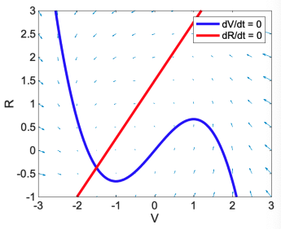
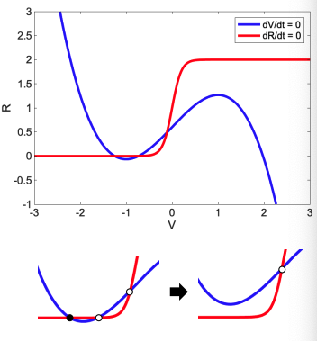

# From Pulses to Oscillators: Bifurcations 2

## Fitzhugh's Analysis of Membrane Excitability

Problem: Empirical models of excitability (including the Hodgkin Huxley model) are oftem intractable (2d, nonlinear, awkward parametrisation)

If its intractable - how can we gain **rigorous** intution of such models? 

Or, how can prove the existence of stable oscillations (limit cycles)?

In the 1960s, Fitzhugh and Nagumo independently developed an analysis of the HH system, based around several observations and simplifying assumptions:

Fast:
- $ C \dot{V} = I - g_L (V - E_L) - g_K n^4 (V - E_K) - g_{Na} m^3 h (V - E_{Na}) $
- $ \tau_m(V) \dot{m} = m_\infty(V) - m $

Slow:
- $ \tau_n(V) \dot{n} = n_\infty(V) - n $
- $ \tau_h(V) \dot{h} = h_\infty(V) - h $

- Although there are 4 state bariable, they are highly correlated
2. There is a separation of timescales between a fast pair of variables $(V,m)$ and slow 'recovery variables' $(n,h)$.
3. The fast variable nullcline is non-monotonic and can be approximated by a cubic form

## The Fitzhugh-Nagumo System

The FN system, written in dimensionless form:

$$
\dot V = 10 (\frac{-V^3}{3}+V - R + I_{inp}) \\ 
\dot R = 0.8(1.25V - R + 1.5)
$$

where $V$ is the fast subsystem, $R$ is the slow subsystem.

The phase plane with $V$ and $R$ nullclines shows that there is a single fixed point in the absence of an input ($I_{inp}$) at

$$
(V,R) = (-1.5, -\frac{3}{8})
$$

The Jacobian is:

$$
\begin{pmatrix}
10-10V^2 & -10 \\
1 & -0.8
\end{pmatrix}
$$

With eigenvalues at fixed points:

$$
\lambda _1 = -11.6,  \lambda_2 =- 1.7
$$

## Loss of Stability

As we change the input $I_{inp}$, the fixed point loses stability. E.g. at $I_{inp} = 1, \lambda_i = 2.8\pm3j $.

What can we say about trajectories in this system?

1. We may find a closed curve (bounding box in the figure) in which all trajectories point inwards from inspection of sign changes at the nullcline
2. Then apply the Poincare-Bendixon Theorem to conclude that there must be a stable limit cycle inside the box region

## Hopf Bifurcation Theorem

Consider an $n$-dimensional dynamical system:

$$
\dot x = f(x;a)
$$

with an isolated equilibirum at $x_0$. Suppose there is a critical value of the parameter $a=a_H$$ such that the eigenvalues of the linearisation of the system at $x_0$:

- all have negative real part in some range $a<a_H$
- have exactly one pair of pure imaginary values $\lambda = \pm jw$ at $a = a_H$
- have some positive real parts for $a>a_H$

Then, there is an asympototically stable limit cycle in some range $a>a_H$ (supercritical) or else an unstable limit cycle in some range $a<a_H$ (subcritical). 
Near the critical value of $a=a_H$, the frequency of oscillation will be approximately $\frac{w}{2\pi}$.

The bifurcation at $a=a_H$ is called a **Hopf bifurcation**.

## Thresholds, Hysteresis and Simplified Models

A quantitative analysis reveals that HH undergoes a subcritical Hopf bifurcation when depolarising current is injected.

A consequence of this is **hysteresis**, in the onset and termination of oscillations.

## Saddle-Node Bifurcations

The R nullcline in the FN system has a linear dependence on $V$, which is unrealistic non-locally.

Lets suppose that is has a saturation:

$$
\dot v = -v^3 + rv - w + I \\ 
\dot w = \epsilon (sat(v) - \gamma w = w_0)
$$

where $sat(.)$ is some saturating function, such as the sigmoidal or Hill function.

We therefore get a different configuration of nullclines.
This can result in a stable/unstable pair of equilibria that merge and annihilate as input current increases, leaving only one unstable equlibirum.

What can we say about oscillation frequency close to this bifurcation?

## Other Cellular Oscillations

Two fundamental examples of biological oscillators are the **cell cycle** and the **circadian rhythm**. 

## Delay-Induced Oscillations

**circadian rhythms** are 24h oscillations that phase lock to the night\day cycle

$$
\dot P = \frac{K}{K+T^n} - \beta P \\
\dot T = \gamma P - \alpha T
$$

1. Lets show that this system does not oscillate:

Find steady state values, form the Jacobian, find stability etc.

2. Linearise the system at its fixed point and introduce a pure time delay in feedback between $P$ and $T$ - will oscillations occur?

---

# Assigned Reading

Modeling the cell cycle: why do
certain circuits oscillate?

exercise: build and analyse the model in Figure 8 of Ferrell et al (2011) – are the dynamics
related to those we have seen in electrically excitable cells?